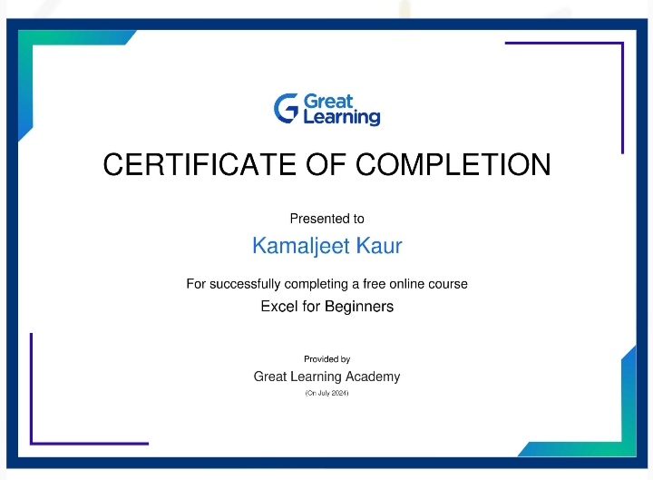

## Kamal-jeetkaur.github.io
 _Im Kamaljeet Kaur, born and brought up in Malerkotla. Im 17 years old. I have done my schooling from Govt. Sen. Sec. School, Bhogiwal, with Science stream. Currently I am pursuing my B.tech in Computer Science and Engineering from Guru Nanak Dev Engineering College, Ludhiana. I have a keen interest in exploring new things. I like to do artistic and creative work in my free time such as sketching and painting. I also enjoy reading books and have made it a goal to read at least 10 books this year. I hope to explore new areas and challenges in the coding field._
 <h3 align="center"> Excel Certificate </h3>
 

<h3 align="center"> Senior Secondary Examination </h3>

| Sr. No| Subject Name    | Marks Obtained |
| ------ | ----------------| ---------------|
| 1 | General English | 92 | 
| 2 | General Punjabi | 94 |
| 3| Physics         | 83 |
| 4 | Chemistry       | 95 |
| 5 | Mathematics     | 91 |

